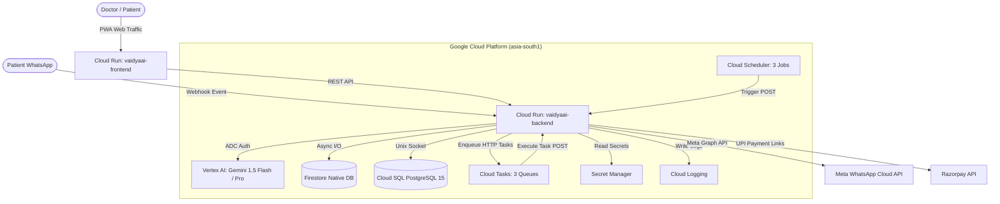

# VaidyaAI — Autonomous AI Workforce Platform for Solo Healthcare Clinics

[](https://cloud.google.com)
[](https://cloud.google.com/vertex-ai)
[](https://fastapi.tiangolo.com)
[](https://nextjs.org)
[](LICENSE)

VaidyaAI is an autonomous, event-driven 7-agent AI workforce designed to handle administrative, financial, clinical, and patient engagement workflows for solo clinic doctors across Tier-2/3 India. Built specifically for **GCP `asia-south1` (Mumbai)** and powered by **Google Vertex AI (Gemini 1.5 Flash & Pro)**, VaidyaAI operates deterministically via Meta WhatsApp Cloud API and a modern Next.js 14 PWA Doctor Dashboard.

---

## 🏛️ Autonomous 7-Agent Architecture



### The 7 Autonomous AI Agents
1. **AppointmentFlow (Agent 1):** Multi-lingual WhatsApp booking, cancellation, rescheduling, emergency redirection, and automated Cloud Tasks reminders (T-2h, T+24h).
2. **ClinicalScribe (Agent 2):** Ambient audio chunk ingestion, Speech-to-Text speaker diarization, PHI anonymization, and Gemini 1.5 Pro SOAP note generation with ICD-10 coding.
3. **BillingPulse (Agent 3):** Automated invoice generation (`VDY-YYYYMMDD-XXXX`), Razorpay UPI payment link delivery via WhatsApp, fee waivers, cash marking, and daily 9 PM IST P&L summary reports.
4. **RetentionRadar (Agent 4):** Chronic disease follow-up tracking, missed appointment recovery, regional language outreach (Telugu, Hindi, Tamil, English), and 8 AM IST automated scans.
5. **PrescriptionSafe (Agent 5):** Gemini 1.5 Flash drug-drug interaction checks, allergy conflict detection, severity scoring (`CRITICAL`, `HIGH`, `MEDIUM`, `LOW`), and clinical audit logging.
6. **InsightEngine (Agent 6):** Practice Health Score calculation (0-100), weekly growth recommendations, Cloud Scheduler Sunday 8 PM IST execution, and XPRIZE hackathon evidence package export.
7. **ReferralCoordinator (Agent 7):** Specialist referral extraction from SOAP notes, formal referral letter drafting, lab order tracking, and WhatsApp delivery.

---

## 📁 Repository Structure

```text
VAIDYAAI/
├── backend/                  # FastAPI Application (Python 3.11)
│   ├── agents/               # 7 Autonomous AI Agent Implementations
│   ├── api/                  # REST API Endpoints & Webhook Handlers
│   ├── database/             # Firestore & PostgreSQL Models and Migrations
│   ├── models/               # SQLAlchemy 2.0 ORM & Pydantic Schemas
│   ├── prompts/              # System Prompts & Intent Detection Templates
│   ├── services/             # Vertex AI, WhatsApp, Razorpay, STT Services
│   ├── tasks/                # Cloud Tasks HTTP Dispatchers
│   ├── tests/                # Pytest Unit & End-to-End Test Suite
│   ├── config.py             # BaseSettings Environment Config
│   ├── main.py               # FastAPI App & Health Probes
│   └── Dockerfile            # Multi-stage Container Manifest
├── frontend/                 # Next.js 14 PWA Dashboard (TypeScript + Tailwind)
│   ├── src/app/              # Next.js App Router (Appointments, Patients, Analytics, Billing)
│   ├── src/components/       # UI Components (SOAPEditor, Queue, SafetyFlags)
│   ├── package.json          # Node Dependencies
│   └── Dockerfile            # Standalone Production Build Container
├── infrastructure/           # CloudBuild Manifests
├── scripts/                  # GCP Setup, Secrets & Automated Deploy Scripts
│   ├── gcp_setup.sh          # Infrastructure Provisioning Script
│   ├── setup_secrets.sh      # Secret Manager Initializer
│   └── deploy.sh             # Cloud Run Deployment Script
├── firebase.json             # Firebase Configuration
├── firestore.rules           # Security Rules (DPDP Act 2023 Tenant Isolation)
├── firestore.indexes.json    # Firestore Compound Indexes
└── README.md                 # Technical Documentation
```

---

## 🛠️ Local Development Setup

### Prerequisites
- Python 3.11+
- Node.js 20+
- Docker (optional)

### 1. Backend Setup (FastAPI)
```bash
cd backend
python3 -m venv .venv
source .venv/bin/activate
pip install -r requirements.txt

# Run pytest test suite (13 test modules)
python3 -m pytest tests/

# Start FastAPI development server
uvicorn main:app --reload --port 8000
```

### 2. Frontend Setup (Next.js 14)
```bash
cd frontend
npm install

# Start Next.js development server
npm run dev
```
Open `http://localhost:3000` to access the Doctor Dashboard PWA.

---

## ☁️ Google Cloud Deployment (`asia-south1`)

### Project Details
- **Google Cloud Project ID:** `vaidyaai-xprize`
- **Region:** `asia-south1` (Mumbai)
- **Service Account:** `vaidyaai-backend@vaidyaai-xprize.iam.gserviceaccount.com`

### Deploy via Script
```bash
chmod +x scripts/deploy.sh
./scripts/deploy.sh
```

---

## 🔐 Compliance & Security
- **DPDP Act 2023:** Automatic patient phone masking (`+91XXXXXX3210`) at database, logging, and LLM prompt layers.
- **Tenant Isolation:** Firebase Auth JWT custom claim (`clinic_id`) enforcement across all endpoints and Firestore rules.
- **HMAC Signatures:** Meta WhatsApp (`x-hub-signature-256`) and Razorpay (`x-razorpay-signature`) webhook signature verification.

---

## 📄 License
This project is licensed under the MIT License — see the [LICENSE](LICENSE) file for details.
