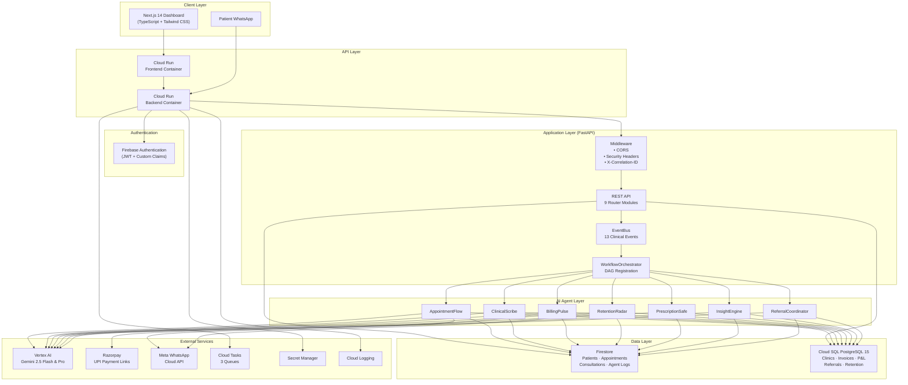
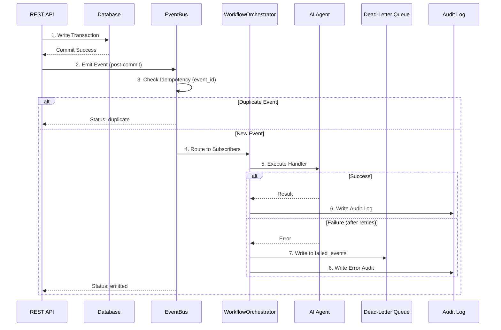
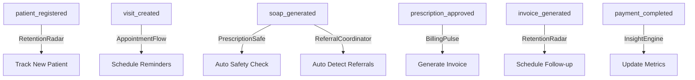

<p align="center">
  <strong>🏥 VaidyaAI</strong>
</p>

<p align="center">
  <em>Autonomous AI Workforce Platform for Solo Healthcare Clinics</em>
</p>

<p align="center">
  <a href="#-quick-start"></a>
  <a href="LICENSE"></a>
  <a href="#-technology-stack"></a>
  <a href="#-technology-stack"></a>
  <a href="#-technology-stack"></a>
  <a href="#-technology-stack"></a>
  <a href="#-technology-stack"></a>
  <a href="#-deployment"></a>
  <a href="#-technology-stack"></a>
</p>

---

## Table of Contents

- [Introduction](#-introduction)
- [Problem Statement](#-problem-statement)
- [Why VaidyaAI](#-why-vaidyaai)
- [Key Features](#-key-features)
- [Architecture Overview](#-architecture-overview)
- [Event-Driven Architecture](#-event-driven-architecture)
- [Clinical Workflow](#-clinical-workflow)
- [AI Agent Orchestration](#-ai-agent-orchestration)
- [Technology Stack](#-technology-stack)
- [Repository Structure](#-repository-structure)
- [Screenshots](#-screenshots)
- [Quick Start](#-quick-start)
- [Running Tests](#-running-tests)
- [API Overview](#-api-overview)
- [Security Model](#-security-model)
- [Event Bus](#-event-bus)
- [AI Agents](#-ai-agents)
- [Deployment](#-deployment)
- [Performance](#-performance)
- [Accessibility](#-accessibility)
- [Quality Gates](#-quality-gates)
- [Demo Instructions](#-demo-instructions)
- [Roadmap](#-roadmap)
- [Contributing](#-contributing)
- [License](#-license)
- [Acknowledgements](#-acknowledgements)

---

## 🏥 Introduction

**VaidyaAI** is an event-driven, 7-agent AI workforce platform purpose-built for solo and small clinic doctors across Tier-2 and Tier-3 cities in India. It autonomously handles appointment booking, clinical documentation, prescription safety, billing, patient retention, specialist referrals, and practice analytics — allowing doctors to focus entirely on patient care.

The platform is built on **Google Cloud Platform (asia-south1 & us-central1)**, powered by **Vertex AI (Gemini 2.5 Flash & Pro)**, and delivers its intelligence through a modern **Next.js 14** doctor dashboard and **Meta WhatsApp Cloud API** for patient communication.

> **Note:** VaidyaAI is currently in **Release Candidate** stage. It has passed all automated quality gates (39 pytest tests, ESLint, Next.js production build, and 7-agent E2E journey test) but has not yet undergone formal compliance certification for healthcare regulations such as HIPAA, GDPR, or NABH.

---

## 🎯 Problem Statement

Solo clinic doctors in India's Tier-2/3 cities face a unique operational challenge: they serve 40-80 patients daily while simultaneously managing appointments, clinical documentation, billing, follow-ups, and practice growth — with zero administrative staff.

Existing EHR solutions (Epic, Cerner, Athenahealth) are designed for large hospital systems with dedicated IT departments, making them prohibitively expensive and complex for independent practitioners.

**VaidyaAI bridges this gap** by deploying 7 autonomous AI agents that handle administrative workflows end-to-end, requiring zero manual data entry from the doctor.

---

## 💡 Why VaidyaAI

| Challenge | Existing Solutions | VaidyaAI |
|---|---|---|
| Appointment Management | Manual phone calls, paper registers | WhatsApp-native booking in Telugu, Hindi, Tamil, English |
| Clinical Documentation | Typed notes between patients | Ambient audio → AI-generated SOAP notes with ICD-10 codes |
| Prescription Safety | Manual drug reference lookup | Automated drug-drug interaction and allergy conflict detection |
| Billing & Payments | Cash-only, no digital records | UPI payment links via Razorpay, automated invoice generation |
| Patient Follow-ups | Forgotten or missed entirely | Autonomous chronic disease tracking and regional language outreach |
| Specialist Referrals | Handwritten letters | Structured referral letters extracted from SOAP notes |
| Practice Analytics | No visibility | Weekly Practice Health Score (0-100) with growth recommendations |

---

## ✨ Key Features

### Clinical Workflow
- **Patient Registration** — Firestore-backed demographic records with allergy and chronic condition tracking
- **Appointment Queue** — Real-time queue management with Firestore `onSnapshot` listeners
- **Consultation Workspace** — Ambient audio recording, Speech-to-Text transcription, SOAP note generation
- **Prescription Management** — Automated drug safety validation before doctor approval
- **Billing & Payments** — Invoice generation with Razorpay UPI payment links, cash marking, daily P&L reports
- **Patient Timeline** — Longitudinal visit history, medication records, lab results

### AI Platform
- **Event-Driven Architecture** — 13 clinical event types, in-process async Pub/Sub bus
- **7 Autonomous AI Agents** — Each with dedicated Vertex AI prompts and audit trails
- **Idempotent Event Processing** — Rolling deduplication prevents duplicate invoices and prescriptions
- **Dead-Letter Queue** — Failed agent executions captured for manual review
- **Correlation Tracing** — `event_id` → `causation_id` → `correlation_id` chain across all operations

### Enterprise Features
- **Feature Flags** — 6 runtime-configurable toggles for safe rollout
- **Security Headers** — `X-Frame-Options`, `X-Content-Type-Options`, `X-XSS-Protection`, `Referrer-Policy`
- **PHI Anonymization** — Indian phone numbers, Aadhaar, emails, and patient names stripped before LLM calls
- **Tenant Isolation** — Firebase JWT custom claims enforce clinic-scoped data access
- **Production Validation** — Startup rejects placeholder secrets and SQLite in production
- **Dual-Write Audit** — Every AI decision logged to both Google Cloud Logging and Firestore

---

## 🏗 Architecture Overview



---

## ⚡ Event-Driven Architecture

VaidyaAI uses an in-process asynchronous Pub/Sub event bus that coordinates all 7 AI agents through a deterministic workflow DAG.

### Event Lifecycle



### 13 Clinical Event Types

| Event | Trigger | Downstream Agents |
|---|---|---|
| `patient_registered` | New patient created | RetentionRadar |
| `visit_created` | Appointment confirmed | AppointmentFlow |
| `queue_updated` | Queue position change | Audit only |
| `consultation_started` | Doctor opens consultation | — |
| `soap_generated` | SOAP note approved | PrescriptionSafe → ReferralCoordinator |
| `prescription_created` | Rx order created | — |
| `prescription_approved` | Safety check passed | BillingPulse |
| `invoice_generated` | Invoice issued | RetentionRadar |
| `payment_completed` | Payment confirmed | InsightEngine |
| `referral_created` | Referral letter sent | — |
| `followup_scheduled` | Follow-up booked | — |
| `analytics_updated` | Metrics recalculated | — |
| `audit_written` | Audit log entry | — |

### Event Envelope (14 Fields)

Every event carries a standardized metadata envelope:

```json
{
  "event_id": "evt_2d72004529e142ed",
  "event_type": "soap_generated",
  "version": 1,
  "timestamp": "2026-07-31T05:12:00.000Z",
  "correlation_id": "corr_2e749400a2ad",
  "causation_id": "evt_previous_event_id",
  "tenant_id": "cln_e2e_test_clinic",
  "clinic_id": "cln_e2e_test_clinic",
  "patient_id": "pat_001",
  "visit_id": "app_001",
  "consultation_id": "cons_001",
  "doctor_id": "doc_001",
  "user_id": null,
  "trigger": "api",
  "payload": {}
}
```

### Idempotency & Dead-Letter Queue

- **Deduplication**: Rolling set of processed `event_id` values (cap: 10,000 with FIFO eviction of oldest 2,000)
- **Retry**: Exponential backoff — `min(2^attempt × 0.1, 2.0)` seconds (0.2s, 0.4s, max 2.0s)
- **DLQ**: Failed events written to Firestore `failed_events` collection with status `pending_review`

---

## 🩺 Clinical Workflow

```mermaid
graph LR
    A["Patient Arrives<br/>Walk-In or WhatsApp"] --> B["Registration<br/>Demographics · Allergies"]
    B --> C["Queue<br/>Real-time Position"]
    C --> D["Consultation<br/>Audio Recording"]
    D --> E["SOAP Note<br/>AI Generated · ICD-10"]
    E --> F["Safety Check<br/>Drug Interactions"]
    F --> G["Prescription<br/>Doctor Approval"]
    G --> H["Billing<br/>UPI Invoice"]
    H --> I["Payment<br/>Razorpay / Cash"]
    I --> J["Follow-Up<br/>Automated Outreach"]
    J --> K["Analytics<br/>Practice Health Score"]
```



---

## 🤖 AI Agent Orchestration

### Workflow DAG



> **Ordering guarantee**: When `soap_generated` fires, PrescriptionSafe executes **before** ReferralCoordinator.

### The 7 Agents

| # | Agent | Model | Purpose | Key Inputs | Key Outputs |
|---|---|---|---|---|---|
| 1 | **AppointmentFlow** | Gemini 2.5 Flash | WhatsApp appointment booking, rescheduling, cancellation, emergency redirection | Incoming WhatsApp message, clinic schedule | Intent classification, booking confirmation, Cloud Tasks reminders |
| 2 | **ClinicalScribe** | Gemini 2.5 Pro | Ambient audio transcription, SOAP note generation with ICD-10 coding | Audio chunks, vitals, patient history | Structured SOAP note, diagnoses, medications, investigations |
| 3 | **BillingPulse** | — | Invoice generation, Razorpay UPI payment links, daily P&L summaries | Consultation approval, fee schedule | Invoice record, payment link, WhatsApp delivery |
| 4 | **RetentionRadar** | Gemini 2.5 Flash | Chronic disease follow-up tracking, missed appointment recovery | Patient consultations, follow-up schedules | Regional language outreach messages (Telugu, Hindi, Tamil, English) |
| 5 | **PrescriptionSafe** | Gemini 2.5 Pro | Drug-drug interaction checks, allergy conflict detection | Medication list, patient allergies, age | Safety verdict (CRITICAL/HIGH/MEDIUM/LOW), warnings |
| 6 | **InsightEngine** | Gemini 2.5 Flash | Practice Health Score (0-100), weekly growth recommendations | Clinic metrics, billing data | Executive summary, recommendations, WhatsApp report |
| 7 | **ReferralCoordinator** | Gemini 2.5 Flash | Specialist referral extraction from SOAP notes, formal letter drafting | SOAP note content, diagnoses | Referral letter, urgency level, lab order tracking |

---

## 🛠 Technology Stack

### Backend

| Component | Technology | Purpose |
|---|---|---|
| Framework | FastAPI 0.111 | Async REST API server |
| Language | Python 3.11 | Application runtime |
| ORM | SQLAlchemy 2.0 (async) | PostgreSQL object mapping |
| Relational DB | Cloud SQL PostgreSQL 15 | Invoices, clinics, P&L, referrals |
| Document DB | Firestore (Native mode) | Patients, appointments, consultations, agent logs |
| AI/ML | Vertex AI (Gemini 2.5 Flash & Pro) | Intent detection, SOAP generation, safety checks |
| Speech | Google Cloud Speech-to-Text | Ambient audio transcription |
| Auth | Firebase Admin SDK | JWT verification, custom claims |
| Payments | Razorpay API | UPI payment link generation |
| Messaging | Meta WhatsApp Cloud API v19.0 | Patient communication |
| Task Queue | Google Cloud Tasks | Appointment reminders, billing follow-ups |
| Secrets | Google Cloud Secret Manager | Runtime credential injection |
| Logging | Google Cloud Logging | Structured audit logs |
| PDF | ReportLab | Prescription and referral letter generation |
| HTTP Client | HTTPX | Async external API calls |

### Frontend

| Component | Technology | Purpose |
|---|---|---|
| Framework | Next.js 14 (App Router) | Server-rendered React application |
| Language | TypeScript 5.4 (strict mode) | Type-safe application code |
| Styling | Tailwind CSS 3.4 | Dark-first utility CSS with custom design tokens |
| State | Zustand | Lightweight client state management (2 stores) |
| Icons | Lucide React | Consistent iconography |
| Auth | Firebase Auth | Phone-based authentication |
| Real-time | Firestore onSnapshot | Live appointment queue and agent activity feeds |
| HTTP | Axios | REST API client with tiered timeouts and retry |
| Fonts | Inter + JetBrains Mono | Typography system |

### Infrastructure

| Component | Technology | Purpose |
|---|---|---|
| Compute | Cloud Run (asia-south1) | Serverless container hosting |
| Container | Docker (multi-stage) | Deterministic builds |
| CI/CD | GitHub Actions | Automated testing pipeline |
| DNS/CDN | Firebase Hosting | Static asset delivery |
| Schema Migration | Alembic | PostgreSQL schema versioning |

---

## 📁 Repository Structure

```text
VAIDYAAI/
├── backend/                          # FastAPI Application (Python 3.11)
│   ├── agents/                       # 7 Autonomous AI Agent Implementations
│   │   ├── base_agent.py             # BaseAgent ABC with timed Gemini calls
│   │   ├── appointment_flow.py       # Agent 1: WhatsApp Booking
│   │   ├── clinical_scribe.py        # Agent 2: SOAP Note Generation
│   │   ├── billing_pulse.py          # Agent 3: Invoice & Payment
│   │   ├── retention_radar.py        # Agent 4: Patient Retention
│   │   ├── prescription_safe.py      # Agent 5: Drug Safety
│   │   ├── insight_engine.py         # Agent 6: Practice Analytics
│   │   └── referral_coordinator.py   # Agent 7: Specialist Referrals
│   ├── api/                          # REST API Endpoint Modules
│   │   ├── appointments.py           # Appointment CRUD & queue
│   │   ├── billing.py                # Invoice & payment endpoints
│   │   ├── consultations.py          # Consultation & SOAP endpoints
│   │   ├── patients.py               # Patient CRUD
│   │   ├── clinics.py                # Clinic profile & config
│   │   ├── analytics.py              # Dashboard analytics
│   │   ├── auth.py                   # JWT verification & tenant isolation
│   │   ├── agent_health.py           # Agent health diagnostics
│   │   ├── internal.py               # Cloud Tasks & Scheduler endpoints
│   │   └── webhooks.py               # WhatsApp & Razorpay webhooks
│   ├── database/                     # Data Access Layer
│   │   ├── firestore.py              # Firestore CRUD helpers + in-memory fallback
│   │   └── postgres.py               # SQLAlchemy async engine & session
│   ├── models/                       # SQLAlchemy ORM Models
│   │   ├── clinic.py                 # Clinic, Subscription
│   │   ├── billing.py                # Invoice, DailyPLSummary
│   │   ├── consultation.py           # AgentExecutionStats
│   │   └── patient.py                # ReferralTracking, RetentionOutreach
│   ├── prompts/                      # Vertex AI System Prompts
│   │   ├── appointment_intent.py     # Intent detection prompt
│   │   ├── soap_generation.py        # SOAP note prompt
│   │   ├── drug_safety.py            # Drug interaction prompt
│   │   ├── retention_outreach.py     # Retention message prompt
│   │   ├── referral_extraction.py    # Referral detection prompt
│   │   ├── insight_report.py         # Analytics report prompt
│   │   └── enquiry_templates.py      # WhatsApp message templates
│   ├── services/                     # External Service Integrations
│   │   ├── gemini.py                 # Vertex AI Gemini (Flash & Pro)
│   │   ├── whatsapp.py               # Meta WhatsApp Cloud API
│   │   ├── razorpay_svc.py           # Razorpay Payment Links
│   │   ├── speech_to_text.py         # Google Cloud STT
│   │   └── pdf_generator.py          # ReportLab PDF generation
│   ├── utils/                        # Shared Utilities
│   │   ├── agent_logger.py           # Dual-write audit logger
│   │   ├── phi_anonymiser.py         # PHI/PII stripping for LLM
│   │   ├── phone_utils.py            # Phone normalization & masking
│   │   ├── date_utils.py             # IST date utilities
│   │   ├── secret_manager.py         # GCP Secret Manager wrapper
│   │   └── evidence_export.py        # Evidence package export
│   ├── tasks/                        # Cloud Tasks Dispatchers
│   ├── tests/                        # Pytest Test Suite (39 tests)
│   ├── alembic/                      # Database Migrations
│   ├── event_bus.py                  # In-process Async Pub/Sub
│   ├── workflow_orchestrator.py      # Agent DAG Registration
│   ├── config.py                     # Pydantic Settings + Feature Flags
│   ├── main.py                       # FastAPI App + Health Probes
│   ├── Dockerfile                    # Multi-stage Container
│   ├── cloudbuild.yaml               # Cloud Build Manifest
│   └── requirements.txt              # Python Dependencies (24 packages)
├── frontend/                         # Next.js 14 Dashboard (TypeScript)
│   ├── src/
│   │   ├── app/                      # App Router (8 routes)
│   │   │   ├── (auth)/login/         # Login page
│   │   │   └── (dashboard)/          # Protected dashboard routes
│   │   │       ├── page.tsx          # Dashboard home
│   │   │       ├── analytics/        # Analytics & KPIs
│   │   │       ├── billing/          # Invoice management
│   │   │       ├── consultation/[id] # Consultation workspace
│   │   │       ├── logs/             # AI activity logs
│   │   │       ├── patients/         # Patient registry
│   │   │       ├── patients/[id]     # Patient longitudinal record
│   │   │       └── settings/         # Agent health & config
│   │   ├── components/               # 98 React Components
│   │   │   ├── design-system/        # Primitives (Button, Badge, Panel, etc.)
│   │   │   ├── layout/              # AppShell, Sidebars, CommandPalette
│   │   │   ├── consultation/        # ConsultationWorkspace
│   │   │   ├── analytics/           # Charts & KPI cards
│   │   │   ├── billing/             # Invoice & payment UI
│   │   │   ├── patients/            # Patient cards & search
│   │   │   ├── patient-detail/      # Longitudinal record views
│   │   │   ├── operations/          # Agent monitoring
│   │   │   ├── queue/               # Queue management
│   │   │   ├── shared/              # Reusable widgets
│   │   │   └── timeline/            # Decision timeline
│   │   ├── hooks/                    # 6 React Hooks
│   │   ├── store/                    # 2 Zustand Stores
│   │   └── lib/                      # API client, auth, constants, utils
│   ├── Dockerfile                    # Multi-stage (node:18-alpine)
│   ├── tailwind.config.ts            # Custom design system
│   ├── next.config.mjs               # Standalone output mode
│   └── package.json                  # Node Dependencies
├── scripts/                          # Automation & Testing
│   ├── e2e_demo_test.py              # 7-Agent E2E Journey Test
│   ├── chaos_test.py                 # Reliability & Chaos Testing
│   ├── load_test.py                  # Scaled Workload Benchmarks
│   ├── verify_clinical_scenarios.py  # 10 Clinical Acceptance Tests
│   ├── seed_demo_data.py             # Demo Mode Data Seeder
│   ├── deploy.sh                     # Cloud Run Deployment
│   ├── gcp_setup.sh                  # GCP Infrastructure Provisioning
│   └── setup_secrets.sh              # Secret Manager Initializer
├── firestore.rules                   # Firestore Security Rules
├── firestore.indexes.json            # Compound Index Definitions
├── firebase.json                     # Firebase Project Config
├── storage.rules                     # Cloud Storage Security Rules
├── .github/workflows/ci.yml          # GitHub Actions CI Pipeline
├── CONTRIBUTING.md                   # Contribution Guidelines
├── CODE_OF_CONDUCT.md                # Contributor Covenant v2.1
├── SECURITY.md                       # Security Policy
├── CHANGELOG.md                      # Release History
├── LICENSE                           # Apache License 2.0
└── README.md                         # This file
```

---

## 📸 Screenshots

> Screenshots of the VaidyaAI dashboard can be captured by running the application locally with demo seed data. See [Demo Instructions](#-demo-instructions).

| View | Description |
|---|---|
| **Dashboard** | Real-time queue, AI activity feed, billing summary, agent status |
| **Consultation** | SOAP editor, audio recorder, safety flags, patient context banner |
| **Patients** | Registry with search, filters, risk badges, longitudinal records |
| **Analytics** | Revenue charts, KPI cards, agent reliability matrix |
| **Billing** | Invoice table, payment analytics, daily P&L summary |
| **AI Logs** | Decision timeline with latency badges, agent chips, correlation IDs |
| **Settings** | Agent workforce health table, audit trail, system configuration |

---

## 🚀 Quick Start

### Prerequisites

- Python 3.11+
- Node.js 20+
- Docker (optional, for containerized deployment)

### Backend Setup

```bash
cd backend

# Create virtual environment
python3 -m venv .venv
source .venv/bin/activate

# Install dependencies
pip install -r requirements.txt

# Configure environment
cp .env.example .env
# Edit .env with your credentials (or use defaults for development)

# Start FastAPI server
uvicorn main:app --reload --port 8000
```

The backend starts at `http://localhost:8000` with:
- API docs: `http://localhost:8000/docs`
- Health check: `http://localhost:8000/health`
- Liveness probe: `http://localhost:8000/livez`
- Readiness probe: `http://localhost:8000/readyz`

### Frontend Setup

```bash
cd frontend

# Install dependencies
npm install

# Start development server
npm run dev
```

The dashboard opens at `http://localhost:3000`.

### Seed Demo Data

```bash
# Populate the database with realistic demo patients, appointments, and SOAP notes
python3 scripts/seed_demo_data.py
```

### Environment Variables

<details>
<summary>Click to expand full environment variable reference</summary>

| Variable | Required | Default | Description |
|---|---|---|---|
| `ENVIRONMENT` | No | `development` | `development` or `production` |
| `GOOGLE_CLOUD_PROJECT` | Yes | `vaidyaai-xprize` | GCP Project ID |
| `GCP_REGION` | No | `asia-south1` | GCP Region |
| `DATABASE_URL` | Yes | `sqlite+aiosqlite:///./test.db` | PostgreSQL connection string |
| `FIREBASE_PROJECT_ID` | Yes | `vaidyaai-xprize` | Firebase Project ID |
| `WHATSAPP_PHONE_ID` | Prod | — | Meta WhatsApp Phone Number ID |
| `WHATSAPP_ACCESS_TOKEN` | Prod | — | Meta WhatsApp Access Token |
| `WHATSAPP_VERIFY_TOKEN` | Prod | — | Webhook verification token |
| `WHATSAPP_APP_SECRET` | Prod | — | HMAC signature verification secret |
| `RAZORPAY_KEY_ID` | Prod | — | Razorpay API Key ID |
| `RAZORPAY_KEY_SECRET` | Prod | — | Razorpay API Key Secret |
| `RAZORPAY_WEBHOOK_SECRET` | Prod | — | Razorpay Webhook Secret |
| `INTERNAL_TASK_SECRET` | Prod | — | Cloud Tasks authentication secret |
| `BACKEND_URL` | Yes | — | Backend Cloud Run URL |
| `CORS_ORIGINS` | No | `http://localhost:3000` | Comma-separated allowed origins |
| `FEATURE_AI_AUTONOMOUS` | No | `true` | Enable autonomous AI event triggers |
| `FEATURE_WHATSAPP` | No | `true` | Enable WhatsApp messaging |
| `FEATURE_VOICE` | No | `true` | Enable audio recording & STT |
| `FEATURE_REALTIME_EVENTS` | No | `true` | Enable EventBus orchestration |
| `FEATURE_ANALYTICS` | No | `true` | Enable InsightEngine analytics |
| `FEATURE_DEMO_MODE` | No | `true` | Enable development mock fallbacks |

</details>

---

## 🧪 Running Tests

### Backend Test Suite (39 tests)

```bash
cd backend
python3 -m pytest tests/ -vv
```

Test coverage includes:
- **Agent logic**: Intent detection, SOAP prompts, drug safety, retention, referrals, billing
- **Security**: JWT verification, tenant isolation, webhook signatures, config validation, LLM fail-closed
- **Event Bus**: Envelope creation, subscribe/emit, idempotency, error isolation, DAG registration
- **E2E Integration**: Complete 7-agent patient journey

### Frontend Quality Checks

```bash
cd frontend

# ESLint validation
npm run lint

# TypeScript compilation + production build
npm run build
```

### End-to-End 7-Agent Journey

```bash
python3 scripts/e2e_demo_test.py
```

Executes the complete clinical workflow: AppointmentFlow → ClinicalScribe → PrescriptionSafe → BillingPulse → ReferralCoordinator → RetentionRadar → InsightEngine.

### Additional Validation Suites

```bash
# Chaos & reliability testing (Vertex AI fallback, duplicate webhooks, event deduplication, DLQ)
python3 scripts/chaos_test.py

# Scaled workload benchmarks (Scenarios A through D)
python3 scripts/load_test.py

# 10 clinical acceptance scenarios
python3 scripts/verify_clinical_scenarios.py
```

---

## 📡 API Overview

All REST endpoints are prefixed with `/api/v1` and require Firebase JWT authentication (except webhooks and health probes).

| Module | Prefix | Key Endpoints |
|---|---|---|
| **Appointments** | `/api/v1/appointments` | Create, list today, update status, walk-in registration |
| **Patients** | `/api/v1/patients` | CRUD, search by phone, allergy/condition management |
| **Consultations** | `/api/v1/consultations` | Start, SOAP generation, approval, audio upload |
| **Billing** | `/api/v1/billing` | Today's summary, invoice list, cash marking, fee waiver |
| **Analytics** | `/api/v1/analytics` | Dashboard metrics, P&L summary, agent performance |
| **Clinics** | `/api/v1/clinics` | Profile, schedule, fee configuration |
| **Agents** | `/api/v1/agents` | Agent health status, execution stats |
| **Internal** | `/internal` | Cloud Tasks callbacks, scheduled job triggers |
| **Webhooks** | `/` | WhatsApp message webhook, Razorpay payment webhook |

### Health Probes

| Endpoint | Purpose | Auth |
|---|---|---|
| `GET /livez` | Liveness probe (dependency-free) | None |
| `GET /readyz` | Readiness probe (startup checks) | None |
| `GET /health` | Extended diagnostics (Vertex AI, Firestore, PostgreSQL, feature flags, agents) | None |

---

## 🔐 Security Model

> For the complete security policy, see [SECURITY.md](SECURITY.md).

### Implemented Controls

| Layer | Mechanism | Implementation |
|---|---|---|
| **Authentication** | Firebase JWT | `get_current_user()` with async verification |
| **Authorization** | Tenant Isolation | `verify_clinic_access()` enforces `clinic_id` claim |
| **Firestore** | Security Rules | Tenant-scoped reads; ALL writes via Admin SDK |
| **Cloud Storage** | Signed URLs | All direct client access denied |
| **Internal APIs** | Shared Secret | HMAC `compare_digest` with fail-closed placeholder detection |
| **Webhooks** | HMAC-SHA256 | WhatsApp (`sha256=` prefix) and Razorpay signature verification |
| **PHI Protection** | `anonymise_for_llm()` | Strips phones, Aadhaar, emails, names before LLM calls |
| **Phone Masking** | `mask_phone()` | `+919876543210` → `+91XXXXXX3210` in logs, DB, and responses |
| **HTTP Headers** | Security Middleware | `X-Frame-Options: DENY`, `X-Content-Type-Options: nosniff`, etc. |
| **LLM Safety** | Fail-Closed | `RuntimeError` in production if model unavailable; mock only in dev |
| **Config Validation** | Startup Check | Rejects placeholder secrets and SQLite URLs in production |
| **Secrets** | GCP Secret Manager | Runtime mounting via `--set-secrets` in Cloud Run |
| **Audit** | Dual-Write | Google Cloud Logging + Firestore `agent_logs` |

### Not Implemented (Future Work)

HIPAA, GDPR, ISO 27001, NABH, HL7 FHIR, ABDM, CSP headers, CSRF, rate limiting, WAF, penetration testing, SOC 2.

---

## 📊 Event Bus

The event bus is an in-process asynchronous Pub/Sub system implemented in `event_bus.py`.

### Key Properties

| Property | Value |
|---|---|
| Event Types | 13 (`ClinicalEvent` enum) |
| Envelope Fields | 14 (event_id, correlation_id, causation_id, etc.) |
| Idempotency | Rolling set of 10,000 event IDs with FIFO eviction |
| Retry Strategy | Exponential backoff: `min(2^attempt × 0.1, 2.0)` seconds |
| Error Isolation | Failing subscriber does not block other subscribers |
| Dead-Letter Queue | Firestore `failed_events` collection (status: `pending_review`) |
| Audit Trail | Every emission logged to Firestore `agent_logs` |
| Agent States | 6 states: IDLE, RUNNING, SUCCESS, FAILED, RETRYING, DISABLED |

---

## 🚢 Deployment

### Cloud Run (Production)

```bash
# Deploy backend + frontend to Cloud Run
chmod +x scripts/deploy.sh
./scripts/deploy.sh all
```

**Backend Container:**
- Image: `asia-south1-docker.pkg.dev/${PROJECT_ID}/vaidyaai-docker-repo/vaidyaai-backend`
- Resources: 2 vCPU, 2 GiB RAM
- Scaling: 1-10 instances, 80 concurrent requests
- Service Account: `vaidyaai-backend@${PROJECT_ID}.iam.gserviceaccount.com`
- 14 secrets mounted from GCP Secret Manager

**Frontend Container:**
- Image: Multi-stage `node:18-alpine` with standalone Next.js output
- Resources: 1 vCPU, 512 MiB RAM
- Scaling: 0-5 instances
- Non-root user (`nextjs:nodejs`, uid 1001)

### Cloud Scheduler Jobs

| Job | Schedule | Agent | Purpose |
|---|---|---|---|
| `retention-radar-daily` | 8:00 AM IST | RetentionRadar | Chronic disease follow-up scan |
| `insight-engine-weekly` | Sunday 8:00 PM IST | InsightEngine | Weekly Practice Health Score |
| `billing-pnl-daily` | 9:00 PM IST | BillingPulse | Daily P&L summary report |

### Cloud Tasks Queues

| Queue | Purpose |
|---|---|
| `appointment-reminders` | T-2h and T+24h appointment reminders |
| `billing-followups` | T+24h unpaid invoice reminders |
| `retention-outreach` | Follow-up outreach scheduling |

---

## ⚡ Performance

### Implemented Optimizations

| Optimization | Implementation |
|---|---|
| **Tiered API Timeouts** | 5s reads, 15s AI operations, 30s exports |
| **Automatic Retry** | 1-retry with 1s delay for timeouts and 503 errors |
| **Skeleton Loaders** | `SkeletonCard`, `SkeletonTable`, `SkeletonChart` across all routes |
| **Async I/O** | All Firestore and Vertex AI calls use `asyncio.to_thread()` |
| **Connection Pooling** | SQLAlchemy: pool_size=10, max_overflow=20, pool_recycle=1800 |
| **Draft Persistence** | SOAP notes auto-saved to `localStorage` on every keystroke |
| **Standalone Build** | Next.js standalone output for minimal Docker image size |
| **EventBus Throughput** | ~26,000 events/sec measured at Scenario D (5,000 events) |

### Load Test Results

| Scenario | Clinicians | Events | Throughput | Avg Latency |
|---|---|---|---|---|
| A (Small Clinic) | 3 | 15 | 153 evt/s | 13.06 ms |
| B (Medium Clinic) | 10 | 80 | 22,233 evt/s | 0.09 ms |
| C (District Hospital) | 50 | 500 | 29,997 evt/s | 0.07 ms |
| D (National Demo) | 100 | 5,000 | 26,405 evt/s | 0.08 ms |

---

## ♿ Accessibility

| Feature | Implementation |
|---|---|
| Focus Rings | High-contrast teal focus indicators (`border-focus: #14B8A6`) |
| ARIA Attributes | `role="dialog"`, `role="status"`, `aria-label`, `aria-expanded`, `aria-live="polite"` |
| Keyboard Navigation | `Cmd/Ctrl+K` (Command Palette), `Cmd/Ctrl+N` (Walk-In), `Cmd/Ctrl+S` (Save), `Esc` (Close) |
| Dark Mode | Default dark theme with considered contrast ratios |
| Semantic HTML | Proper heading hierarchy, landmark regions, form labels |
| Loading States | Skeleton loaders with `role="status"` and screen reader labels |

---

## ✅ Quality Gates

All of the following must pass before any release:

```bash
# 1. Backend — 39 automated tests
python3 -m pytest backend/tests/ -vv

# 2. Frontend — ESLint validation
cd frontend && npm run lint

# 3. Frontend — Production build (10 routes)
npm run build

# 4. End-to-End — 7-agent clinical journey
python3 scripts/e2e_demo_test.py

# 5. Chaos — Reliability and resilience
python3 scripts/chaos_test.py

# 6. Clinical — 10 acceptance scenarios
python3 scripts/verify_clinical_scenarios.py
```

### CI Pipeline (GitHub Actions)

The `.github/workflows/ci.yml` runs on every push to `main`/`master` and all pull requests:

- **Backend Job**: Python 3.11, byte-compile validation, `pytest`
- **Frontend Job**: Node 20, TypeScript check (`tsc --noEmit`), `npm run lint`, `npm run build`

---

## 🎬 Demo Instructions

### 1. Start Services

```bash
# Terminal 1: Backend
cd backend && source .venv/bin/activate && uvicorn main:app --reload --port 8000

# Terminal 2: Frontend
cd frontend && npm run dev
```

### 2. Seed Demo Data

```bash
python3 scripts/seed_demo_data.py
```

This populates the system with:
- 3 patients (Ramesh Sharma, Priya Nair, Anita Verma) with medical histories
- 3 appointments for today's queue (completed, in consultation, waiting)
- 1 approved consultation with SOAP note, ICD-10 codes, and medications
- 5 agent decision logs demonstrating autonomous AI activity

### 3. Access Dashboard

Open `http://localhost:3000` and log in with development credentials (auto-bypass in dev mode).

### 4. Suggested Demo Flow

1. **Dashboard** — Observe real-time queue, AI activity feed, billing summary
2. **Patients** — Browse patient registry, view longitudinal records
3. **Consultation** — Open active consultation, review SOAP note, approve
4. **Billing** — View generated invoice, observe payment link
5. **Analytics** — Review Practice Health Score and agent metrics
6. **AI Logs** — Inspect decision timeline with correlation IDs
7. **Settings** — Monitor agent workforce health status

### 5. Run E2E Test (Live Demo)

```bash
python3 scripts/e2e_demo_test.py
```

---

## 🗺 Roadmap

### Implemented ✅

- Complete clinical workflow (registration → consultation → billing → analytics)
- 7 autonomous AI agents with Vertex AI Gemini integration
- Event-driven architecture with 13 event types and workflow DAG
- Idempotent event processing with dead-letter queue
- Firebase Authentication with tenant isolation
- WhatsApp patient communication (4 regional languages)
- Razorpay UPI payment integration
- 39-test automated test suite + E2E journey test
- Chaos, load, and clinical acceptance testing
- Multi-stage Docker containers for Cloud Run
- CI pipeline (GitHub Actions)
- Feature flags, security headers, PHI anonymization

### Future Work 🔮

- **FHIR R4 / ABDM Compliance** — Map SOAP notes to Ayushman Bharat Digital Mission health document standards
- **Multi-Clinic Aggregation** — Corporate manager view for clinic chains
- **Voice Command Co-Pilot** — Real-time doctor voice commands during consultation
- **Offline-First PWA** — Service worker with IndexedDB for rural connectivity
- **HL7 Integration** — Lab result import from diagnostic centers
- **Regulatory Compliance** — HIPAA, GDPR, ISO 27001, NABH alignment
- **Advanced Security** — CSP headers, CSRF protection, rate limiting, WAF
- **Performance Monitoring** — Core Web Vitals tracking (LCP, INP, CLS)
- **Mobile Application** — Native iOS/Android companion app
- **Automated Coding Audit** — ICD-10 coding accuracy validation

---

## 🤝 Contributing

We welcome contributions! Please read our [Contributing Guide](CONTRIBUTING.md) and [Code of Conduct](CODE_OF_CONDUCT.md) before submitting changes.

For security vulnerabilities, please refer to our [Security Policy](SECURITY.md).

---

## 📄 License

This project is licensed under the **Apache License 2.0** — see the [LICENSE](LICENSE) file for details.

---

## 🙏 Acknowledgements

- **Google Cloud Platform** — Vertex AI, Cloud Run, Firestore, Cloud Tasks, Cloud Logging
- **Meta** — WhatsApp Business Cloud API
- **Razorpay** — UPI Payment Infrastructure
- **Firebase** — Authentication and real-time database
- **Vercel** — Next.js framework
- **FastAPI** — High-performance Python web framework
- **Open Source Community** — SQLAlchemy, Pydantic, Zustand, Tailwind CSS, Lucide, and all dependencies
