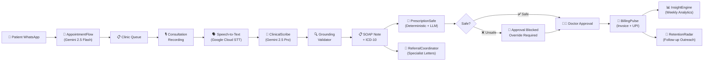
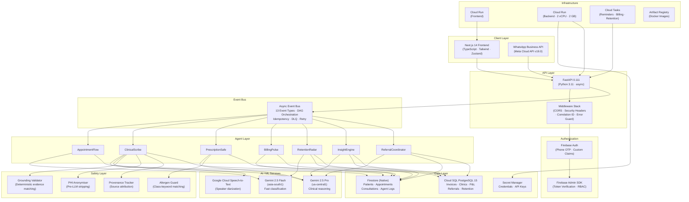
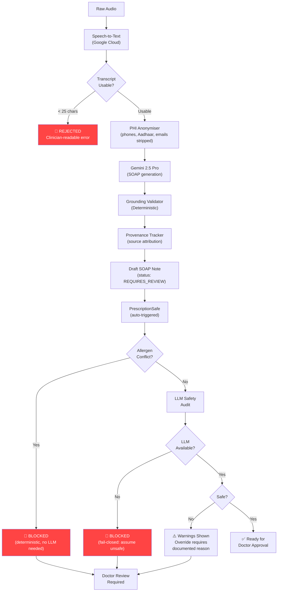
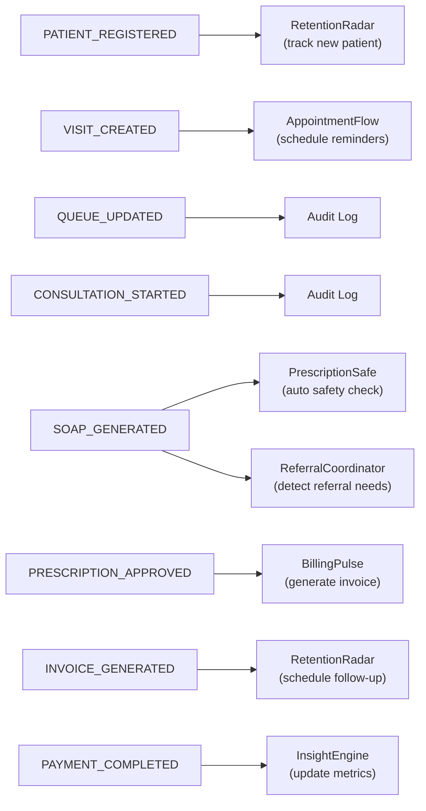
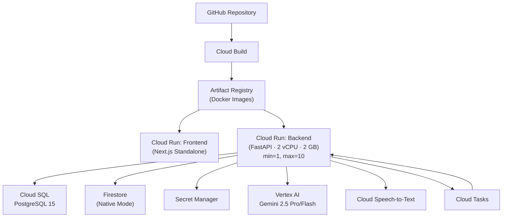
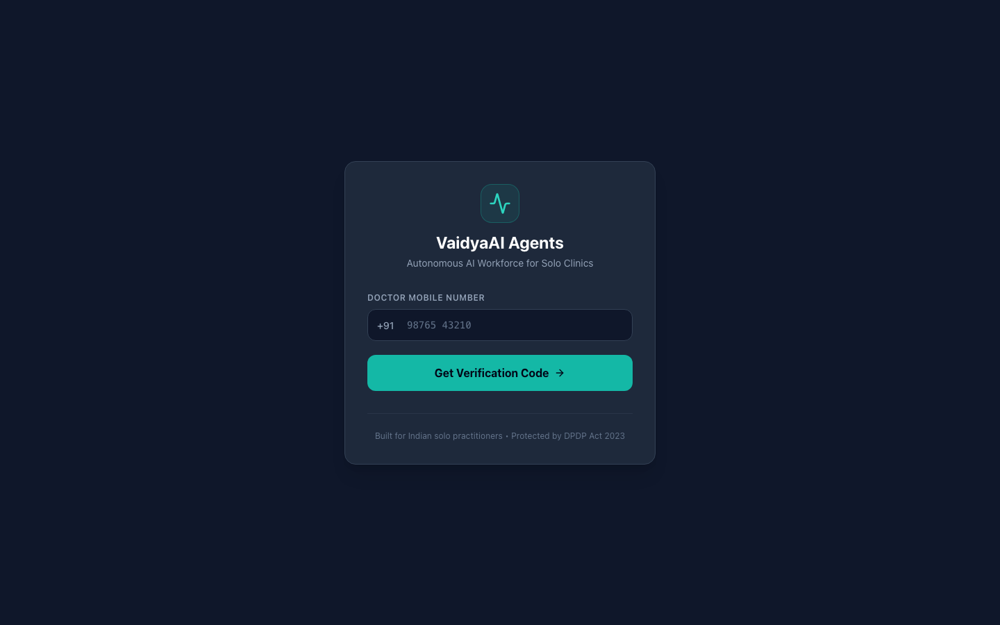

< · Category: Professional Services Access*

[](https://github.com/vinay2214-cloud/Vaidyaai/actions)
[](https://www.python.org/downloads/release/python-3110/)
[](https://nextjs.org/)
[](https://cloud.google.com/vertex-ai/generative-ai/docs/model-reference/gemini)
[](LICENSE)
[](https://cloud.google.com/run)

</div>

---

## Live Demo

| | |
|---|---|
| **Frontend** | https://vaidyaai-frontend-353775352272.asia-south1.run.app |
| **Backend API** | https://vaidyaai-backend-353775352272.asia-south1.run.app/docs |
| **Service health** | https://vaidyaai-backend-353775352272.asia-south1.run.app/health |
| **AI telemetry** | https://vaidyaai-backend-353775352272.asia-south1.run.app/api/v1/ai/live-status |
| **Demo video** | https://youtu.be/q6UvraiMXeM |

Both services run on **Google Cloud Run** in `asia-south1`. Sign-in uses Firebase phone auth.

**Judge testing access:** Phone `+91 98497 45859` · OTP `123456` — a Firebase test phone; this code works only for this specific number and signs in to a demo clinic with test data.

---

## Executive Summary

India has **1.2 million solo-practice clinics** where a single doctor sees 40–80 patients daily while simultaneously managing appointments, clinical documentation, prescriptions, billing, referrals, follow-ups, and analytics. There is no receptionist, no transcriptionist, no billing clerk.

**VaidyaAI** deploys **seven autonomous AI agents** — each powered by Gemini 2.5 — to run the complete clinic back-office. A patient messages on WhatsApp; an agent books the appointment. The doctor speaks during the consultation; an agent transcribes, structures a SOAP note, codes ICD-10 diagnoses, and extracts prescriptions. Another agent validates every prescription against the patient's documented allergies and drug interactions — *and refuses to let the doctor sign off until safety is cleared*. On approval, an agent generates an invoice, creates a UPI payment link, and sends it via WhatsApp. Another tracks chronic-care follow-ups. Another generates weekly executive reports. Another drafts specialist referral letters.

**The core engineering thesis:** clinical AI is only useful if it is *structurally prevented from inventing things*. Two mechanisms enforce this:

1. **Deterministic Grounding Validator** — rejects any clinical fact lacking a verbatim evidence span in the consultation transcript. Unsupported assertions are dropped and logged, unrecorded vitals stay null, AI-suggested diagnoses are marked provisional.
2. **Fail-Closed Safety Architecture** — PrescriptionSafe blocks sign-off entirely on un-overridden allergen conflicts or drug interactions. If the LLM is unreachable, the prescription is flagged unsafe (not assumed safe). Mock AI fallback is disabled in production.

This is not an AI chatbot. This is not a documentation assistant. This is an **AI-native clinic operating system** where seven agents coordinate through an event-driven workflow DAG, every decision is auditable, and deterministic safety gates sit between every AI output and every clinical action.

---

## The Problem

### What Solo Doctors Face Today

| Problem | Consequence |
|---|---|
| No staff for appointment scheduling | Missed patients, phone tag, no-shows without follow-up |
| Manual clinical documentation | 15+ minutes per patient on paperwork; physician burnout |
| No real-time decision support | Drug interactions and allergy conflicts caught late or not at all |
| Paper-based or disconnected billing | Revenue leakage, no financial visibility, delayed collections |
| No follow-up system | Chronic patients lost to follow-up; poor continuity of care |
| No operational intelligence | Doctors run clinics blind — no data on throughput, revenue trends, or retention |
| Fragmented tools | Separate apps for scheduling, records, billing, and communication that don't talk to each other |

### Why Existing Approaches Fall Short

| Approach | Limitation |
|---|---|
| Traditional EHR software | Designed for hospitals with IT departments; too expensive and complex for solo practices |
| AI documentation assistants | Generate notes but don't connect to billing, scheduling, or safety workflows |
| Generic chatbots | Answer questions but don't take autonomous clinical actions with safety gates |
| Voice scribes | Transcribe but don't validate, ground, or enforce provenance on clinical facts |

### The VaidyaAI Opportunity

Build a single platform where seven AI agents autonomously operate the complete clinic workflow — from the patient's first WhatsApp message to the weekly P&L summary — with every AI output grounded in evidence, every prescription safety-checked, and every action auditable.

---

## Why VaidyaAI Is Different

| Traditional EHR | VaidyaAI |
|---|---|
| Record-centric — stores data passively | Workflow-centric — agents take autonomous actions |
| Manual documentation | Ambient AI transcription → structured SOAP with provenance |
| Safety checks as optional add-ons | Fail-closed safety gates that block approval until cleared |
| AI as a separate "copilot" layer | AI embedded into every workflow stage via 7 specialized agents |
| Retrospective reporting | Real-time operational intelligence with Practice Health Score |
| Single-language interfaces | Multilingual (Telugu, Hindi, Tamil, English) from intent to outreach |
| Generic outputs assumed correct | Deterministic grounding — every fact requires transcript evidence |
| Disconnected systems | End-to-end: WhatsApp → Scribe → Safety → Billing → Follow-up → Analytics |

---

## The Seven Agents

| # | Agent | Model | Trigger | What It Does | Safety Boundary |
|---|---|---|---|---|---|
| 1 | **AppointmentFlow** | Gemini 2.5 Flash | WhatsApp message | Classifies intent (book/cancel/reschedule/emergency), detects language, offers slots via interactive list, books appointment, schedules T-2h reminder and T+24h wellness check via Cloud Tasks | Emergency messages redirect to 108; opted-out patients are skipped |
| 2 | **ClinicalScribe** | Gemini 2.5 Pro | Doctor records audio | Transcribes via Google Cloud Speech-to-Text with speaker diarization, anonymises PHI, generates SOAP note with ICD-10 codes, extracts medications/allergies/referrals, runs grounding validation | Empty/unusable transcripts rejected before LLM; low-confidence (<60%) transcripts require manual review before approval |
| 3 | **PrescriptionSafe** | Gemini 2.5 Pro + Deterministic | SOAP generated (auto-triggered via event bus) | Validates prescriptions against patient allergies (deterministic class-keyword matching), drug interactions (LLM pharmacology analysis), dosage safety | **Fail-closed**: allergen conflicts block instantly (no LLM needed); LLM unavailability flags prescription as unsafe; stale safety checks detected via medication signature hashing |
| 4 | **BillingPulse** | Deterministic | Prescription approved | Generates sequential invoice (VDY-YYYYMMDD-XXXX), creates Razorpay UPI payment link, sends WhatsApp invoice, schedules T+24h payment reminder, records daily P&L, handles payment confirmation/waiver | Idempotency guard prevents duplicate invoices; waiver requires documented reason |
| 5 | **RetentionRadar** | Gemini 2.5 Flash | Scheduled daily / post-invoice | Scans approved consultations for overdue follow-ups, generates multilingual outreach messages, sends via WhatsApp, tracks re-engagement | PHI anonymised before LLM; respects patient opt-out |
| 6 | **InsightEngine** | Gemini 2.5 Pro | Weekly schedule / on-demand | Aggregates 7-day metrics across Firestore + PostgreSQL, computes Practice Health Score, generates executive briefing with growth recommendations, delivers via WhatsApp | Deterministic fallback health score if LLM output is unavailable |
| 7 | **ReferralCoordinator** | Gemini 2.5 Pro | SOAP generated (auto-triggered via event bus) | Detects referral needs from SOAP notes, drafts formal specialist referral letters with clinical summary, tracks referral status | Urgency never silently downgraded — escalation aliases map to "urgent"; clinician's explicit urgency always wins over model's |

---

## End-to-End Clinical Workflow



### What Happens at Each Stage

| Stage | Implemented Action | Clinical Value |
|---|---|---|
| **Patient Contact** | WhatsApp message classified by intent and language via Gemini 2.5 Flash | Multilingual access; no app download required |
| **Appointment** | Slot offered via interactive list; booking persisted in Firestore; Cloud Tasks schedules reminders | Reduced no-shows; queue management |
| **Recording** | Audio chunks uploaded; assembled via FFmpeg; transcribed with speaker diarization | Ambient capture — doctor speaks naturally |
| **Transcription** | Google Cloud Speech-to-Text (te-IN, hi-IN, en-IN); confidence scoring | Code-switched audio support (Telugu + English) |
| **PHI Anonymisation** | Phone numbers, Aadhaar, emails, patient names stripped before LLM call | Protected Health Information never reaches Gemini |
| **SOAP Generation** | Gemini 2.5 Pro generates structured SOAP + ICD-10 + medications from anonymised transcript | Saves 15+ minutes of documentation per patient |
| **Grounding Validation** | Deterministic validator checks every symptom, vital, medication, allergy, and duration against raw transcript; unsupported facts rejected and logged | Zero-fabrication enforcement — AI cannot invent unreported symptoms |
| **Safety Check** | Deterministic allergen-class matching (penicillin, sulfa, NSAIDs, cephalosporins) + LLM pharmacology audit | Drug-allergy conflicts caught before prescription reaches patient |
| **Approval Gate** | Low-confidence transcripts require explicit review; prescriptions require safety clearance; stale safety checks detected | Human-in-the-loop at every safety-critical boundary |
| **Billing** | Sequential invoice, Razorpay UPI link, WhatsApp delivery, daily P&L aggregation | Digital collections; financial visibility |
| **Follow-up** | RetentionRadar scans for overdue follow-ups; sends multilingual outreach | Chronic care continuity; reduced loss-to-follow-up |
| **Analytics** | InsightEngine computes Practice Health Score from real metrics across both databases | Data-driven practice improvement |
| **Interoperability** | FHIR R4 export with full provenance; ABDM-aligned patient identifiers | Future-ready for national health information exchange |

---

## Architecture



---

## AI Architecture

### Model Selection Strategy

| Model | Location | Temperature | Purpose | Why This Model |
|---|---|---|---|---|
| **Gemini 2.5 Pro** | `us-central1` | 0.1 | SOAP generation, drug safety analysis, insight reports, referral letters | High-stakes clinical reasoning requires maximum accuracy; low temperature minimises creative variation in medical output |
| **Gemini 2.5 Flash** | `asia-south1` | 0.2 | Intent classification, retention outreach, fast triage | Low-latency responses needed for real-time WhatsApp interaction; co-located with deployment region |

### AI Execution Policy

| Setting | Value | Enforced By |
|---|---|---|
| `LIVE_CLINICAL_AI` | `true` (production) | `config.validate_production()` — server refuses to boot if `false` |
| `AI_ALLOW_MOCK_FALLBACK` | `false` (production) | Same validation — mock responses are structurally impossible in production |
| Timeout | 55s (Pro) / 25s (Flash) | `asyncio.wait_for` with 1 retry per call |
| Retry | 2 attempts with 0.5s backoff | `GeminiService.generate()` |
| JSON parse | 4-stage robust extraction (direct → code fence → brace match → cleaned backticks) | `GeminiService.generate_json()` — fail-closed on unparseable response |
| Token tracking | Prompt, candidate, and total token counts captured per call | `_last_live_execution` telemetry |

---

## Clinical AI Safety Architecture

This is a healthcare application. Every AI output passes through multiple safety layers before reaching a clinical action.



### Safety Mechanisms — All Implemented

| Mechanism | Implementation | Status |
|---|---|---|
| **Empty transcript rejection** | Transcripts < 25 usable characters are refused before LLM | Implemented |
| **PHI anonymisation** | Regex stripping of phone numbers, Aadhaar, emails, names before every LLM call | Implemented |
| **Grounding validation** | Deterministic check that every clinical fact (symptom, vital, medication, allergy) has a verbatim evidence span in the transcript | Implemented |
| **Fabrication rejection** | Unsupported symptom descriptors (e.g. "dry cough" when "dry" was never spoken) are stripped from the output and logged | Implemented |
| **Vital null enforcement** | Vitals not spoken in the transcript remain `null` — never fabricated | Implemented |
| **Provisional diagnosis tagging** | All AI-generated diagnoses marked `is_provisional: true`, `status: AI_SUGGESTION` | Implemented |
| **Allergen-class matching** | Deterministic keyword map (penicillin → amoxicillin/ampicillin/augmentin; sulfa → co-trimoxazole/glimepiride; NSAIDs → ibuprofen/diclofenac/aspirin; cephalosporins → cefixime/ceftriaxone) | Implemented |
| **Fail-closed LLM unavailability** | If Gemini is unreachable during safety check, prescription is flagged `is_safe: false`, `requires_manual_review: true` | Implemented |
| **Stale safety detection** | Medication signature hash is stored after safety evaluation; if the prescription is modified after evaluation, approval is blocked until re-evaluation | Implemented |
| **Low-confidence transcript gate** | STT confidence < 60% requires explicit clinician transcript review before approval can proceed | Implemented |
| **Override audit** | Safety override requires doctor UID, written clinical reason, and timestamp — all logged to Firestore | Implemented |
| **Provenance tracking** | Every clinical fact carries `_provenance` metadata: source, agent, model, evidence span, grounding status, review status | Implemented |
| **NKDA filtering** | "No Known Drug Allergies" markers are filtered out of the allergy list before conflict checking to prevent false positives | Implemented |
| **Event bus audit logging** | Every event emission writes an audit entry to `agent_logs` with handler results, latency, and correlation IDs | Implemented |
| **Dead letter queue** | Failed event handlers are retried with exponential backoff; after exhaustion, events are written to `failed_events` for admin review | Implemented |

---

## Event-Driven Workflow DAG

The seven agents do not call each other directly. They communicate through a 13-event async pub/sub bus with typed events, idempotency guards, and causal chain tracking.



### Event Envelope

Every event carries a 15-field metadata envelope:

```
event_id · event_type · version · timestamp · correlation_id · causation_id
tenant_id · clinic_id · patient_id · visit_id · consultation_id
doctor_id · user_id · trigger · payload
```

`correlation_id` links all events in a single patient journey. `causation_id` forms a causal chain (this event was caused by that event). Tenant isolation is enforced by `clinic_id` on every event.

---

## Technical Stack

### Backend

| Technology | Version | Purpose |
|---|---|---|
| FastAPI | 0.111 | Async API framework with auto-generated OpenAPI docs |
| Python | 3.11 | Runtime — type hints, async/await, structured concurrency |
| SQLAlchemy | 2.0 (async) | ORM for PostgreSQL with asyncpg driver |
| Alembic | 1.13 | Database schema migrations |
| Pydantic | 2.7 | Settings validation with production config enforcement |
| firebase-admin | 6.5 | Token verification, custom claims, Firestore Admin SDK |
| google-cloud-aiplatform | 1.59 | Vertex AI SDK for Gemini 2.5 Pro/Flash |
| google-cloud-speech | 2.26 | Speech-to-Text with speaker diarization |
| google-cloud-tasks | 2.16 | Async task scheduling (reminders, billing, retention) |
| Razorpay SDK | 1.4 | UPI payment link generation and webhook reconciliation |
| ReportLab | 4.2 | PDF prescription/invoice generation |
| python-jose | 3.3 | JWT verification for Firebase tokens |
| FFmpeg | system | Audio chunk concatenation for STT pipeline |

### Frontend

| Technology | Version | Purpose |
|---|---|---|
| Next.js | 14.2 (App Router) | Server/client rendering, standalone output for Cloud Run |
| React | 18.3 | Component-based clinical UI |
| TypeScript | 5.4 (strict) | Type-safe clinical domain modelling |
| Tailwind CSS | 3.4 | Utility-first styling with dark mode |
| Zustand | 4.5 | Lightweight global state (clinic, patient, UI) |
| Axios | 1.19 | HTTP client with Firebase token injection and tiered timeouts |
| Lucide React | 0.378 | Icon system |
| Playwright | 1.62 | End-to-end testing framework |

### Infrastructure

| Technology | Purpose |
|---|---|
| Google Cloud Run | Containerised deployment (frontend + backend), `asia-south1` |
| Cloud SQL PostgreSQL 15 | Relational store — invoices, clinics, P&L, referrals, retention |
| Firestore (Native mode) | Document store — patients, appointments, consultations, agent logs |
| Firebase Auth (phone) | OTP authentication with custom clinic claims |
| Secret Manager | Credential storage (`DATABASE_URL`, `INTERNAL_TASK_SECRET`, `BACKEND_URL`) |
| Cloud Tasks | Async scheduling for appointment reminders, billing follow-ups, retention |
| Artifact Registry | Docker image storage |
| Cloud Build | CI/CD pipeline for both frontend and backend |
| Cloud Logging | Structured production logging |

---

## Data Model

### Firestore (Document Store)

```
patients/
 ├── patient_id, clinic_id, phone, phone_masked
 ├── allergies[], chronic_conditions[]
 ├── language_preference, consent_given, visit_count
 └── created_at, updated_at

appointments/
 ├── clinic_id, patient_id, slot_date, slot_time
 ├── status (booked | in_progress | completed | cancelled | no_show)
 ├── queue_number, consultation_type
 └── reminder_task_name, wellness_task_name

consultations/
 ├── consultation_id, clinic_id, appointment_id, patient_id
 ├── transcript_raw, transcript_anonymised
 ├── clinical_facts{symptoms, vitals, allergies, medications_taken, medical_history}
 ├── soap_note{subjective, objective, assessment, plan}
 ├── diagnoses[], medications[], investigations[], referrals[]
 ├── patient_allergies[], allergy_review_status, allergy_alert
 ├── safety_evaluation{is_safe, warnings, risk_level, overridden, override_reason}
 ├── safety_evaluated_medications (signature hash)
 ├── scribe_metadata{model_used, latency_ms, stt_confidence, confidence_tier}
 ├── grounding_rejections[], grounding_rejection_count
 ├── review_status, status (draft | approved | ai_failed)
 └── _provenance{source, agent_name, grounding_validated, clinician_reviewed}

agent_logs/  (append-only audit trail)
 ├── agent_name, decision_type, decision_made
 ├── clinic_id, correlation_id, causation_id, event_id
 ├── model_used, latency_ms, success
 └── created_at

failed_events/  (dead letter queue)
 ├── event_id, event_type, handler_name
 ├── error, retry_count, event_payload
 └── status (pending_review)
```

### PostgreSQL (Relational Store)

```
clinics
 ├── id (UUID PK), firebase_clinic_id, name, doctor_name, phone
 └── whatsapp_phone_id

invoices
 ├── id (UUID PK), invoice_number (VDY-YYYYMMDD-XXXX, unique)
 ├── clinic_id (FK), patient_id, consultation_firestore_id
 ├── amount_paise, consultation_type, status, payment_method
 ├── razorpay_payment_link_id, razorpay_payment_link_url
 └── created_at, paid_at, reminder_sent_at, waived_reason

daily_pl_summary
 ├── clinic_id (FK), date (unique with clinic_id)
 ├── patients_seen, total_billed_paise, total_collected_paise
 ├── upi_paise, cash_paise, card_paise, invoice_count
 └── created_at, updated_at

retention_outreach
 ├── clinic_id (FK), patient_phone_masked
 ├── trigger_type, message_language, message_text
 └── delivered, appointment_booked_after, sent_at

referral_tracking
 ├── clinic_id (FK), patient_phone_masked
 ├── consultation_firestore_id, referral_type, urgency
 └── suggested_provider, status, created_at
```

---

## API Overview

| Method | Endpoint | Purpose | Auth |
|---|---|---|---|
| `GET` | `/health` | Extended health check with all service statuses, feature flags, and AI telemetry | Public |
| `GET` | `/livez` | Liveness probe (dependency-free, for Cloud Run) | Public |
| `GET` | `/readyz` | Readiness probe (reports startup validation status) | Public |
| `GET` | `/api/v1/ai/live-status` | Real-time AI execution telemetry (model, location, latency, last execution) | Public |
| `POST` | `/webhooks/whatsapp` | WhatsApp webhook receiver with HMAC signature verification | Webhook |
| `POST` | `/webhooks/razorpay` | Razorpay payment webhook with signature verification | Webhook |
| `GET` | `/api/v1/appointments/today` | Today's appointment queue for a clinic | Firebase |
| `POST` | `/api/v1/appointments/walk-in` | Create walk-in appointment with queue number assignment | Firebase |
| `GET` | `/api/v1/patients/{id}` | Patient demographics and medical history | Firebase |
| `POST` | `/api/v1/consultations/{id}/transcribe` | Upload audio chunks, trigger ClinicalScribe (STT → SOAP → Grounding) | Firebase |
| `POST` | `/api/v1/consultations/{id}/approve` | Doctor approval with transcript review and safety gate enforcement | Firebase |
| `POST` | `/api/v1/consultations/{id}/check-safety` | Trigger PrescriptionSafe validation | Firebase |
| `POST` | `/api/v1/consultations/{id}/safety-override` | Override safety warning with documented clinical reason | Firebase |
| `GET` | `/api/v1/billing/invoices` | Invoice list with filtering by status and date range | Firebase |
| `POST` | `/api/v1/billing/{id}/confirm-payment` | Confirm payment (cash, UPI, card) with P&L update | Firebase |
| `GET` | `/api/v1/fhir/patient/{id}/summary` | FHIR R4 International Patient Summary (IPS) export | Firebase |
| `GET` | `/api/v1/fhir/consultation/{id}` | FHIR R4 consultation bundle export | Firebase |
| `GET` | `/api/v1/agents/health` | Real-time agent state machine (idle/running/success/failed) | Firebase |
| `GET` | `/api/v1/stream/events` | SSE stream of real-time clinical events | Firebase |
| `GET` | `/api/v1/analytics/overview` | Practice analytics with financial aggregations | Firebase |

---

## Security & Privacy

### Implemented Controls

| Control | Implementation |
|---|---|
| **Authentication** | Firebase Auth phone OTP; Firebase Admin SDK verifies ID tokens on every API call |
| **Tenant isolation** | `clinic_id` enforced on every Firestore query, every PostgreSQL query, and every event envelope |
| **Firestore security rules** | Frontend write access completely denied (`allow write: if false`); all writes flow through backend Admin SDK |
| **PHI anonymisation** | Phone numbers, Aadhaar, emails, patient names stripped before every LLM API call |
| **Secret management** | Production credentials stored in Google Cloud Secret Manager; referenced by name in Cloud Run |
| **Production boot validation** | Server refuses to start in production with placeholder secrets, SQLite database, mock AI fallback, or wildcard CORS |
| **Security headers** | `X-Frame-Options: DENY`, `X-Content-Type-Options: nosniff`, `X-XSS-Protection`, `Referrer-Policy: strict-origin-when-cross-origin` on every response |
| **Correlation tracing** | `X-Correlation-ID` header propagated through every request for audit trail |
| **Webhook verification** | WhatsApp HMAC signature verification; Razorpay webhook signature verification |
| **Internal task auth** | Cloud Tasks/Scheduler authenticated via `INTERNAL_TASK_SECRET` shared secret |
| **Least privilege** | Docker container runs as unprivileged `appuser`, not root |
| **CORS enforcement** | Explicit origin list (no wildcard); `Allow-Credentials: true` with validated origins |
| **Audit logging** | Every agent decision, every event emission, every safety evaluation written to append-only `agent_logs` |
| **Phone masking** | Patient phone numbers masked in all non-essential storage and logs |

### Not Yet Implemented (Future Compliance)

- HIPAA/ABDM formal compliance certification
- Encryption at rest (beyond Cloud SQL/Firestore defaults)
- SOC 2 Type II audit
- Role-based access control beyond clinic-level isolation

---

## Deployment Architecture



### Cloud Run Configuration (from `cloudbuild.yaml`)

| Parameter | Backend | Frontend |
|---|---|---|
| Region | `asia-south1` | `asia-south1` |
| Memory | 2 GB | 512 MB |
| CPU | 2 vCPU | 1 vCPU |
| Min instances | 1 (warm) | 0 |
| Max instances | 10 | 4 |
| Concurrency | 80 | 80 |
| Timeout | 300s | 60s |
| Health check | `/livez` (liveness), `/readyz` (readiness) | Next.js health |
| Service account | `vaidyaai-backend@PROJECT_ID.iam.gserviceaccount.com` | Default |

---

## Local Development

**Prerequisites:** Python 3.11+, Node.js 18+, FFmpeg

### Backend

```bash
cd backend
python3 -m venv .venv && source .venv/bin/activate
pip install -r requirements.txt
cp .env.example .env          # defaults are development-safe
uvicorn main:app --reload --port 8000
```

Serves `http://localhost:8000` with `/docs`, `/health`, `/livez`, `/readyz`.

In development, SQLite is used automatically; in production, Alembic manages the PostgreSQL schema:

```bash
alembic upgrade head
```

### Frontend

```bash
cd frontend
npm install
npm run dev                   # http://localhost:3000
```

> **Note:** `NEXT_PUBLIC_*` values are inlined at **build** time. Production values must be passed as Docker build args — setting them as Cloud Run runtime variables has no effect.

### Seed Demo Data

```bash
python3 scripts/seed_demo_data.py
```

---

## Production Deployment

### Google Cloud Setup

```bash
# Enable required APIs
gcloud services enable \
  run.googleapis.com \
  cloudbuild.googleapis.com \
  artifactregistry.googleapis.com \
  sqladmin.googleapis.com \
  firestore.googleapis.com \
  speech.googleapis.com \
  aiplatform.googleapis.com \
  cloudtasks.googleapis.com \
  secretmanager.googleapis.com

# Create secrets
echo -n "postgresql+asyncpg://..." | \
  gcloud secrets create DATABASE_URL --data-file=-
echo -n "your-internal-secret" | \
  gcloud secrets create INTERNAL_TASK_SECRET --data-file=-
echo -n "https://vaidyaai-backend-XXX.run.app" | \
  gcloud secrets create BACKEND_URL --data-file=-

# Deploy backend
gcloud builds submit --config=backend/cloudbuild.yaml

# Deploy frontend
gcloud builds submit --config=infrastructure/frontend-cloudbuild.yaml

# Deploy Firestore rules and indexes
firebase deploy --only firestore:rules,firestore:indexes

# Run database migrations
gcloud run jobs create alembic-migrate \
  --image=BACKEND_IMAGE --command="alembic upgrade head" \
  --execute-now
```

### Verification

```bash
# Health check
curl https://YOUR-BACKEND-URL/health | python3 -m json.tool

# AI execution status
curl https://YOUR-BACKEND-URL/api/v1/ai/live-status | python3 -m json.tool
```

---

## Testing

**209 test functions across 36 test files.**

```bash
cd backend && python3 -m pytest tests/ -q
```

| Area | Test Files | What Is Covered |
|---|---|---|
| **Grounding validation** | `test_grounding_validator_examples.py`, `test_vitals_preservation.py` | Unsupported descriptors rejected; fabricated durations caught; vitals null enforcement |
| **Fail-closed safety** | `test_llm_failclosed.py`, `test_safety_gate_regression.py`, `test_safety_stale_gate.py`, `test_billing_safety_gate.py` | LLM unavailability → prescription flagged unsafe; stale safety check detection; billing blocked without safety clearance |
| **Prescription safety** | `test_prescription_safe.py` | Allergen-class matching; NKDA filtering; drug-name key normalization |
| **Clinical scribe** | `test_clinical_scribe.py`, `test_scribe_failure_surfacing.py` | Empty transcript rejection; LLM failure surfacing; STT error handling |
| **Event bus** | `test_event_bus.py` | Envelope creation; idempotency; error isolation; DAG registration |
| **Security** | `test_internal_auth_security.py`, `test_webhook_signature.py`, `test_stream_tenant_isolation.py` | JWT verification; webhook HMAC; tenant isolation on SSE streams |
| **FHIR** | `test_fhir_reference_integrity.py`, `test_fhir_patient_summary_endpoint.py` | Bundle reference integrity; patient summary export correctness |
| **Billing** | `test_billing_pulse.py`, `test_pricing_consistency.py` | Invoice generation; P&L aggregation; pricing determinism |
| **Agents** | `test_appointment_flow.py`, `test_insight_engine.py`, `test_referral_coordinator.py`, `test_retention_radar.py` | Per-agent unit tests for all 7 agents |
| **CORS** | `test_error_response_cors.py` | Unhandled 500s carry CORS headers |
| **Config** | `test_config_validation.py`, `test_production_hardening.py` | Production boot validation; placeholder detection |
| **E2E** | `test_e2e_integration.py`, `e2e_workflow_test.py` | Full seven-agent patient journey |

Frontend: `npm run lint` (ESLint) + `npm run build` (TypeScript strict mode) + Playwright test framework configured.

---

## Screenshots

<p align="center">

<br/><em>Clinical Dashboard — Today's patient queue, agent activity feed, and operational KPIs</em>
</p>

<p align="center">

<br/><em>Consultation Workspace — SOAP note with ClinicalScribe telemetry: model, region, latency, STT confidence</em>
</p>

<p align="center">

<br/><em>Billing Dashboard — Invoice management, payment tracking, and daily financial summary</em>
</p>

<p align="center">

<br/><em>Operations Timeline — Every agent decision logged with model, latency, and correlation ID</em>
</p>

---

## Judge Demo Flow (5 minutes)

| Step | What to Show | What It Demonstrates |
|---|---|---|
| **1. Login** | Sign in with test phone OTP | Firebase Auth, clinic tenant resolution |
| **2. Dashboard** | View today's queue, agent activity feed, agent health bar | 7 agents deployed, real-time operational visibility |
| **3. Patient** | Open a patient profile; view allergies, conditions, visit history | Longitudinal patient intelligence |
| **4. Consultation** | Start a new consultation; note the readiness checklist (identity, vitals, allergies) | Clinical workflow discipline |
| **5. Record** | Record or upload consultation audio; watch STT process | Ambient voice capture, real-time confidence indicator |
| **6. SOAP Note** | View generated SOAP note; note the provenance banner (model, latency, STT confidence) | AI transparency — every output attributed |
| **7. Safety Check** | Observe PrescriptionSafe auto-evaluation; try prescribing a penicillin-class drug to a penicillin-allergic patient | Fail-closed safety gate — approval is blocked |
| **8. Override** | Show that override requires a written clinical reason | Human-in-the-loop; audit trail |
| **9. Approve** | Approve the consultation; watch BillingPulse auto-generate invoice | Event-driven agent orchestration |
| **10. Audit** | Open the Operations Timeline; view the complete decision chain | Full auditability — every agent, every decision, every millisecond |
| **11. FHIR** | Export patient summary as FHIR R4 | Interoperability readiness |
| **12. Health** | Open `/health` endpoint — show truthful service status | Production transparency; nothing is mocked or hidden |

---

## FHIR R4 Interoperability

VaidyaAI implements a comprehensive FHIR R4 interoperability layer (`integrations/fhir_r4.py`, 517 lines) that maps validated canonical clinical records to standards-compliant resources.

### Implemented FHIR Resources

| Resource | Source | LOINC/ICD-10 Coding |
|---|---|---|
| Patient | Patient registry | — |
| Organization | Clinic registration | — |
| Practitioner / PractitionerRole | Clinic setup | — |
| Encounter | Consultation record | ActCode (ambulatory) |
| Condition | AI-extracted diagnoses (provisional) | ICD-10 |
| AllergyIntolerance | Patient record + transcript extraction | — |
| MedicationRequest | Prescription | — |
| Observation | Vitals (temp, BP, HR, SpO2, weight, RR) | LOINC |
| ServiceRequest | Specialist referrals | — |
| Provenance | AI generation attribution | — |
| Composition | International Patient Summary (IPS) | LOINC |
| AuditEvent | Agent decision audit trail | — |
| Appointment | Scheduling | — |
| Bundle | Collection and Document types | — |

### ABDM Alignment (Planned)

ABDM (Ayushman Bharat Digital Mission) system identifiers are defined for ABHA health accounts, facility registry, and practitioner registry. Integration requires ABHA number availability.

---

## Real-World Impact

| Impact Area | Feature | Measurable Effect |
|---|---|---|
| **Clinician efficiency** | Ambient transcription + auto-SOAP | Designed to save 15+ minutes of documentation per patient |
| **Patient safety** | Deterministic allergen matching + fail-closed safety | Drug-allergy conflicts caught before prescription reaches patient |
| **Revenue capture** | Automated invoicing + UPI payment links | Designed to reduce revenue leakage from manual billing |
| **Care continuity** | RetentionRadar chronic follow-up tracking | Designed to reduce loss-to-follow-up for chronic patients |
| **Operational visibility** | Practice Health Score + weekly executive briefing | Data-driven practice management for first time |
| **Healthcare access** | Multilingual WhatsApp booking (Telugu, Hindi, Tamil, English) | Patients book in their language without an app |
| **Documentation quality** | Grounding validation + provenance tracking | AI-generated notes are evidence-backed, not hallucinated |
| **Interoperability** | FHIR R4 export with IPS support | Future-ready for national health information exchange |

> All impact claims describe *designed capabilities* of implemented features. No clinical outcome metrics or user adoption statistics are claimed.

---

## Scalability

### Technical Scalability

| Dimension | Current Architecture | Scaling Path |
|---|---|---|
| Compute | Cloud Run auto-scaling (1–10 instances) | Increase max instances; add regional deployments |
| Database | Cloud SQL PostgreSQL + Firestore | Read replicas; Firestore scales automatically |
| AI | Vertex AI managed endpoints | Multi-region model endpoints; batch processing |
| Async work | Cloud Tasks queues | Additional queues per task type; Pub/Sub for cross-service |
| State | Stateless API with database persistence | Horizontal scaling with no session affinity |
| Audio | Container-local audio buffering | Cloud Storage for multi-instance audio handling |

### Healthcare Scalability

```
Solo Clinic (current)
  → Multi-doctor Practice (tenant isolation already enforced)
    → Clinic Chain (multi-clinic management via clinic_id)
      → District Health Network (FHIR export + analytics aggregation)
        → State/National Health System (ABDM integration pathway)
```

---

## Current Implementation Status

| Capability | Status | Evidence |
|---|---|---|
| Firebase phone authentication | ✅ Implemented | `api/auth.py`, `frontend/src/lib/auth.ts` |
| Patient registration & management | ✅ Implemented | `api/patients.py`, Firestore `patients/` |
| Appointment booking (WhatsApp) | ✅ Implemented | `agents/appointment_flow.py` (584 lines) |
| Walk-in queue management | ✅ Implemented | `api/appointments.py` |
| Ambient consultation recording | ✅ Implemented | `ConsultationRecorder.tsx`, audio chunk pipeline |
| Speech-to-Text transcription | ✅ Implemented | `services/speech_to_text.py`, Google Cloud STT |
| SOAP note generation (Gemini 2.5 Pro) | ✅ Implemented | `agents/clinical_scribe.py` (532 lines) |
| ICD-10 diagnosis coding | ✅ Implemented | Extracted by ClinicalScribe, tagged provisional |
| Grounding validation | ✅ Implemented | `utils/grounding_validator.py` (460 lines) |
| PHI anonymisation | ✅ Implemented | `utils/phi_anonymiser.py` |
| Provenance tracking | ✅ Implemented | `utils/provenance.py` (117 lines) |
| Prescription safety (deterministic allergen guard) | ✅ Implemented | `agents/prescription_safe.py` (369 lines) |
| Prescription safety (LLM pharmacology audit) | ✅ Implemented | Gemini 2.5 Pro via `prompts/drug_safety.py` |
| Fail-closed safety gates | ✅ Implemented | Approval blocked without safety clearance |
| Stale safety check detection | ✅ Implemented | Medication signature hashing |
| Low-confidence transcript review gate | ✅ Implemented | STT < 60% blocks approval |
| Invoice generation (sequential numbering) | ✅ Implemented | `agents/billing_pulse.py` (602 lines) |
| Razorpay UPI payment links | ✅ Implemented (mock mode) | Contract implemented; live credentials not wired |
| WhatsApp messaging | ✅ Implemented (mock mode) | Meta Cloud API v19.0 contract; live credentials not wired |
| Daily P&L aggregation | ✅ Implemented | `DailyPLSummary` PostgreSQL model |
| Retention outreach | ✅ Implemented | `agents/retention_radar.py` (144 lines) |
| Specialist referral letters | ✅ Implemented | `agents/referral_coordinator.py` (230 lines) |
| Weekly executive briefing | ✅ Implemented | `agents/insight_engine.py` (177 lines) |
| Event-driven workflow DAG | ✅ Implemented | `event_bus.py` (384 lines), `workflow_orchestrator.py` (238 lines) |
| FHIR R4 export (consultation + patient summary) | ✅ Implemented | `integrations/fhir_r4.py` (517 lines) |
| ABDM identifiers | 🔲 Planned | System URIs defined; ABHA integration pending |
| SSE real-time event stream | ✅ Implemented | `api/stream.py`, event bus broadcast |
| Agent health monitoring | ✅ Implemented | `api/agent_health.py`, state machine |
| Production config validation | ✅ Implemented | `config.py` — 12 production safety checks |
| CI/CD pipeline | ✅ Implemented | GitHub Actions (`ci.yml`), Cloud Build |
| Firestore security rules | ✅ Implemented | `firestore.rules` — writes denied to frontend |
| 209 backend tests | ✅ Implemented | 36 test files covering safety, grounding, agents |

---

## Current Limitations

Stated transparently — the live `/health` endpoint reports all of this too.

- **WhatsApp Business API runs in mock mode.** Implemented against the Meta Cloud API v19.0 contract including HMAC webhook verification, but not connected to live credentials for this submission. `FEATURE_WHATSAPP=false`.
- **Payment processing runs in mock mode.** Razorpay UPI link generation and webhook reconciliation are implemented against the production API contract; no live keys are wired. Payments are recorded manually through the Billing screen.
- **Live interim transcript is not streamed.** The Live Transcript panel populates after the recording stops rather than during it. A real-time input-level meter and silence warning cover the trust gap.
- **Single-clinic deployment scale.** Tenant isolation is enforced on every query, but the deployment is sized for solo and small practices, not multi-site networks.
- **Audio chunks buffer on the container filesystem** between upload and transcription. Fine at current concurrency; Cloud Storage is the correct fix before scaling out.
- **No frontend automated test suite.** Playwright is configured but end-to-end UI tests are not yet authored. Frontend validation is TypeScript strict mode + ESLint.
- **Secrets partially fall back to environment variables.** Only `DATABASE_URL`, `INTERNAL_TASK_SECRET`, and `BACKEND_URL` are injected from Secret Manager today.

---

## Future Roadmap

### Near Term
- Connect WhatsApp Business API with live credentials for end-to-end patient communication
- Wire Razorpay live credentials for real payment processing
- Stream interim transcripts in real-time during recording
- Implement Playwright end-to-end UI test suite
- Migrate audio chunk buffering to Cloud Storage

### Medium Term
- ABDM/ABHA integration for national health information exchange
- Voice-first documentation (real-time transcription streaming)
- Multi-language SOAP generation (Telugu, Hindi, Tamil SOAP notes)
- PDF prescription and invoice generation with clinic branding
- Population health analytics across clinic networks
- Offline/edge AI capability for low-connectivity areas

### Long Term
- Multimodal AI (medical imaging integration — X-ray, ECG, lab reports)
- Predictive analytics (disease outbreak detection, patient risk scoring)
- Automated clinical guideline compliance checking
- Hospital network deployment with centralized analytics
- Advanced FHIR interoperability (SMART on FHIR, CDS Hooks)
- HL7 v2 integration for legacy hospital systems

---

## Project Structure

```
vaidyaai/
├── backend/
│   ├── agents/                    # 7 autonomous AI agents
│   │   ├── base_agent.py          # Common Gemini client, timed execution, structured logging
│   │   ├── appointment_flow.py    # Agent 1: WhatsApp booking & scheduling
│   │   ├── clinical_scribe.py     # Agent 2: Ambient transcription & SOAP generation
│   │   ├── prescription_safe.py   # Agent 3: Drug safety & allergen checking
│   │   ├── billing_pulse.py       # Agent 4: Invoicing & payment management
│   │   ├── retention_radar.py     # Agent 5: Follow-up & re-engagement
│   │   ├── insight_engine.py      # Agent 6: Analytics & executive briefing
│   │   └── referral_coordinator.py # Agent 7: Specialist referral coordination
│   ├── api/                       # FastAPI route handlers (11 routers)
│   ├── models/                    # SQLAlchemy ORM models (PostgreSQL)
│   ├── database/                  # Firestore & PostgreSQL clients
│   ├── services/                  # Gemini, STT, Razorpay, WhatsApp, pricing, telemetry
│   ├── prompts/                   # Structured LLM prompt templates (7 prompt modules)
│   ├── integrations/              # FHIR R4 interoperability layer
│   ├── utils/                     # Grounding validator, PHI anonymiser, provenance, secrets
│   ├── tasks/                     # Cloud Tasks scheduling
│   ├── tests/                     # 36 test files, 209 test functions
│   ├── event_bus.py               # Async pub/sub with 13 event types
│   ├── workflow_orchestrator.py   # Agent subscription DAG
│   ├── config.py                  # Pydantic settings with production validation
│   ├── main.py                    # FastAPI app with lifespan validation
│   ├── Dockerfile                 # Multi-stage build, unprivileged user, health check
│   ├── cloudbuild.yaml            # Cloud Build CI/CD for backend
│   └── requirements.txt           # 26 Python dependencies
├── frontend/
│   ├── src/app/                   # Next.js 14 App Router pages
│   ├── src/components/            # React components (consultation, billing, analytics, design system)
│   ├── src/hooks/                 # Custom hooks (useAuth, useConsultation, useAgentHealth, etc.)
│   ├── src/lib/                   # API client, Firebase config, auth helpers
│   ├── src/store/                 # Zustand global state (clinic, patient, UI)
│   ├── Dockerfile                 # Standalone Next.js build with env validation
│   └── package.json               # Dependencies and scripts
├── infrastructure/
│   └── frontend-cloudbuild.yaml   # Cloud Build CI/CD for frontend
├── scripts/                       # Deployment, testing, and verification scripts (26 files)
├── .github/workflows/ci.yml      # GitHub Actions: parallel backend + frontend CI
├── firestore.rules                # Security rules (frontend writes denied)
├── firestore.indexes.json         # 11 composite indexes with TTLs
└── storage.rules                  # Cloud Storage security rules
```

---

## Key Engineering Decisions

| Decision | Why |
|---|---|
| **Gemini 2.5 Pro for clinical reasoning** | Medical SOAP generation and drug safety analysis require high-accuracy reasoning; low temperature (0.1) minimises creative variation in clinical output |
| **Gemini 2.5 Flash for intent/triage** | WhatsApp message classification needs sub-second response; Flash is 10x cheaper and co-located in `asia-south1` |
| **Deterministic grounding over LLM self-consistency** | LLMs cannot reliably detect their own hallucinations; a deterministic validator checking evidence spans against the raw transcript is more reliable than asking the model "are you sure?" |
| **Fail-closed safety over fail-open** | In healthcare, a false positive (blocking a safe prescription) is recoverable (doctor overrides); a false negative (approving an unsafe prescription) is not |
| **Event-driven agents over direct coupling** | Agents listening to typed events on a pub/sub bus are independently testable, auditable, and extensible; adding Agent 8 requires one `bus.subscribe()` call |
| **Dual database (Firestore + PostgreSQL)** | Clinical documents (SOAP notes, transcripts) are naturally document-shaped; financial data (invoices, P&L) requires relational integrity and aggregation queries |
| **PHI anonymisation before every LLM call** | Protected Health Information should never reach external AI services; pre-LLM stripping is an architectural invariant, not an optional feature |
| **Medication signature hashing** | Detecting stale safety checks when the prescription changes after evaluation prevents a modified prescription from sneaking through with an outdated safety clearance |
| **Container-level least privilege** | Docker `USER appuser` ensures the application cannot write to system paths; defense-in-depth against container escape |
| **Production boot validation** | `config.validate_production()` checks 12 conditions (no SQLite, no placeholder secrets, no mock AI, no wildcard CORS, LIVE_CLINICAL_AI=true) and refuses to start if any fail |

---

## Why VaidyaAI Is a Strong Hackathon Candidate

| Criterion | Evidence |
|---|---|
| **Problem significance** | 1.2M solo clinics in India; doctor does everything alone; measurable efficiency and safety gaps |
| **Innovation** | Seven-agent autonomous workforce with deterministic grounding validation — AI is structurally prevented from inventing clinical facts |
| **Technical depth** | 13-event async pub/sub bus, dual-database architecture, deterministic allergen matching with drug-class keyword maps, FHIR R4 IPS export, medication signature hashing for stale safety detection |
| **Gemini utilization** | Both Gemini 2.5 Pro (clinical reasoning) and Flash (fast classification) used across all 7 agents with role-appropriate model selection, temperature tuning, and latency tracking |
| **Healthcare impact** | End-to-end workflow from WhatsApp booking to FHIR export; safety gates at every clinical boundary; multilingual support for underserved populations |
| **User experience** | Custom clinical design system; readiness checklist; provenance telemetry banner; real-time agent activity feed; dark mode clinical interface |
| **Scalability** | Stateless API on Cloud Run with auto-scaling; tenant isolation; Cloud Tasks for async work; dual-database with Firestore for documents and PostgreSQL for relational data |
| **Safety** | Fail-closed architecture across every safety-critical path; deterministic allergen guard; grounding validation; low-confidence review gates; override audit trail |
| **Feasibility** | Fully deployed on Google Cloud Run; 209 passing tests; CI/CD pipeline; production boot validation; health/readiness probes |
| **Deployment** | Live at production URLs; Cloud Build CI/CD; Docker multi-stage builds; Secret Manager integration |
| **Future potential** | ABDM/ABHA integration pathway; FHIR R4 already implemented; architecture supports multi-clinic and population health analytics |

---

## Contributing

See [CONTRIBUTING.md](CONTRIBUTING.md) for contribution guidelines and [CODE_OF_CONDUCT.md](CODE_OF_CONDUCT.md) for community standards.

---

## License

Licensed under the **Apache License 2.0** — see [LICENSE](LICENSE).

Submitted to **Build with Gemini — XPRIZE 2026**, category **Professional Services Access**.

---

## Further Documentation

| Document | Contents |
|---|---|
| [VaidyaAI_TECHNICAL_ARCHITECTURE_v2.md](VaidyaAI_TECHNICAL_ARCHITECTURE_v2.md) | Event-driven architecture, event envelope, DAG, idempotency, DLQ |
| [RUNBOOK_LOCAL_AND_GCP.md](RUNBOOK_LOCAL_AND_GCP.md) | Full local and GCP setup, environment variable reference |
| [DEPLOYMENT_RUNBOOK_FINAL.md](DEPLOYMENT_RUNBOOK_FINAL.md) | Cloud Run deployment, secrets, Cloud SQL, scheduler jobs |
| [SECURITY.md](SECURITY.md) | Security model, implemented controls, disclosure policy |
| [VaidyaAI_PRD_v2.md](VaidyaAI_PRD_v2.md) | Product requirements and clinical rationale |
| [CHANGELOG.md](CHANGELOG.md) | Version history and release notes |

---

<div align="center">

**VaidyaAI** — Seven AI agents. One doctor. Every patient seen, documented, safety-checked, billed, and followed up.

*AI operates. Human decides. Every fact grounded. Every decision auditable.*

<sub>Deployment state described here was verified against the live Cloud Run services on 22 August 2026.</sub>

</div>
]]>
